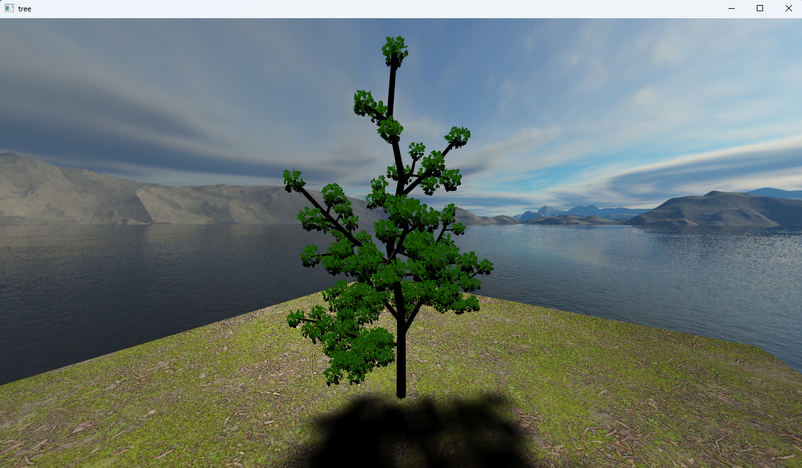

**文件说明**：

* `/code` 存放代码以及一些必要资源，
* `/demo` 存放展示视频
* `/release` 存放可运行文件
* `/resources` 存放所需的图像和glsl文件
* `/pictures`存放md所需的图片

## 完成内容

### **L-system文法**

简要说明下如何实现
设置一个**递归函数**，`level` 会不断递增直至达到 `max_level` 后终止。
通过这个递归过程，**不断随机调整角度以及逐渐变细**即可形成一颗树

```cpp
void add_sub_trunks_lsystem_random(Transform t, unsigned int level, unsigned int max_level, bool is_end_point)
{
...
    //top trunk
    Transform t1;
    //平移
    t1.translate(0, 0.98, 0);
    //旋转
    t1.rotate(0.0f, 1.0f, 0.0f, lerp(rand_vals[2], 0, 2*3.1415f));
    t1.rotate(0.0f, 0.0f, 1.0f, lerp(rand_vals[0], 3.1415f/14.0f, 3.1415f/10.0f));
    t1.rotate(1.0f, 0.0f, 0.0f, lerp(rand_vals[1], 3.1415f/14.0f, 3.1415f/10.0f));
    //大小
    t1.scale(0.8, 0.8, 0.8);
    //在原来变换的基础上
    t1.mult(t);
    //继续递归
    add_sub_trunks_lsystem_random(t1, level+1, max_level, true);
...
}
```

### **附上纹理**

添加纹理的步骤主要分为两步

1. 生成纹理
2. 应用纹理

以树叶纹理为例，生成纹理的过程如下

先使用`stbi_load`加载纹理图像，然后生成并绑定纹理对象，设置环绕和插值方式，最后给纹理对象附上纹理图像。

```cpp
 unsigned char* texture_data;;
 int width, height, nrChannels;
 texture_data = stbi_load("../resources/image/leaves.png", &width, &height, &nrChannels, 0);  // 加载图像
 std::cout << width << " " << height << " " << std::endl;
 glGenTextures(1, &_texture_leaves);  // 生成纹理对象
 glBindTexture(GL_TEXTURE_2D, _texture_leaves);  // 绑定纹理对象
 // 设置环绕方式（重复图像）
 glTexParameteri(GL_TEXTURE_2D, GL_TEXTURE_WRAP_S, GL_REPEAT);
 glTexParameteri(GL_TEXTURE_2D, GL_TEXTURE_WRAP_T, GL_REPEAT);
 // 设置插值方式（线性插值）
 glTexParameteri(GL_TEXTURE_2D, GL_TEXTURE_MIN_FILTER, GL_LINEAR);
 glTexParameteri(GL_TEXTURE_2D, GL_TEXTURE_MAG_FILTER, GL_LINEAR);
 // 当图像加载成功则传入纹理图像
 if (texture_data)
 {
     glTexImage2D(GL_TEXTURE_2D, 0, GL_RGBA, width, height, 0, GL_RGBA, GL_UNSIGNED_BYTE, texture_data);
     glGenerateMipmap(GL_TEXTURE_2D);  // 自动生成多级渐层纹理
 }
 else
 {
     std::cout << "fail to load image" << std::endl;
 }
 stbi_image_free(texture_data);  // 释放图像的内存
 glBindTexture(GL_TEXTURE_2D, 0);  // 解绑
```

应用纹理的第一步则是先传入纹理坐标到顶点着色器，然后顶点着色器再传入到片段着色器。

```cpp
const GLfloat vtexcoord[] = { 0.0f, 1.0f,
                            1.0f, 1.0f,
                            0.5f, 0.0f};

glGenBuffers(1, &_vbo_tex);  // 生成纹理坐标对象
glBindBuffer(GL_ARRAY_BUFFER, _vbo_tex);  // 绑定纹理坐标对象
glBufferData(GL_ARRAY_BUFFER, sizeof(vtexcoord), vtexcoord, GL_STATIC_DRAW);  // 传入纹理坐标
GLuint vtexcoord_id = glGetAttribLocation(_pid, "uv");  // 获取着色器属性的位置
glEnableVertexAttribArray(vtexcoord_id);  // 启动该位置的顶点属性数值
glVertexAttribPointer(vtexcoord_id, 2, GL_FLOAT, GL_FALSE, 0, 0);  //指定顶点属性数据的格式和位置
```

```glsl
// 顶点着色器
in vec2 uv;  // 传入纹理坐标
out vec2 uv_frag;  // 传出到片段着色器
......
void main()
{
    ......
    uv_frag = uv;
}
```

然后在绘制的时候绑定纹理对象，并指定纹理单元。

```cpp
glActiveTexture(GL_TEXTURE1);  // 激活纹理单元
glBindTexture(GL_TEXTURE_2D, _texture_leaves);  // 绑定树叶纹理
glUniform1i(glGetUniformLocation(_pid_ileaves, "leaves_texture"), 1); // 手动设置纹理单元
```

最后在片段着色器中使用texture函数采样纹理颜色并返回最终颜色。

```glsl
......
void main()
{
    ......
    color = texture(leaves_texture, frag_uv);
}
```

当然实际上最终颜色的计算并没有这么简单，在考虑了光照后树叶的最终颜色计算实际如下面代码所示

```glsl
......
void main()
{
    ......
    vec4 get_color = texture(leaves_texture, uv_frag);  // 获得纹理颜色
    vec3 texture_col = vec3(get_color.r, get_color.g, get_color.b);  // 提取rgb值
    color.rgb = vec3(texture_col*light_intensity*reverse_dist_to_middle));  // 和光照阴影混合
    color.a = get_color.a;// 补全a值
}
```

最后需要开启混合功能并设置混合函数，使PNG图像的透明部分在绘制像素的时候也为透明。

```cpp
glEnable(GL_BLEND);
glBlendFunc(GL_SRC_ALPHA, GL_ONE_MINUS_SRC_ALPHA);
```

GL_ONE_MINUS_SRC_ALPHA 表示目标颜色使用 1 减去像素的 alpha 值作为混合因子。该混合方式可实现透明效果。

### **天空盒背景**

创建一个立方体 `skybox` ，贴上纹理
关键操作：

* **深度测试设置**
  通过设置下面内容让天空盒深度永远在最后并且可以绘制
  
  ```cpp
  // 保证天空盒在其他物体之后绘制
  glDepthFunc(GL_LEQUAL); 
  ```
  
  同时 `skybox.vs.glsl` 中设置保证它的深度为1
  
  ```cpp
  //这样天空盒背景的深度就会是1（最远）
  gl_Position = pos.xyww;
  ```

* **将 `view` 矩阵的平移部分省略**
  这样操作后，摄像机的移动就不会导致天空盒的平移
  
  ```cpp
  // 从视图矩阵中移除平移部分
  skybox.set_view_matrix(glm::mat4(glm::mat3(cam->getMatrix())));
  ```

因此就得到了一个天空盒背景

### **传统光照**

用传统的局部光照模型实现光照效果
设置光源，然后通过着色器实现漫反射光照。

### **实现阴影**


**Shadow Mapping** 是一种常用的实时阴影生成技术，通过在场景中的光源视角下渲染深度贴图（Shadow Map），并在后续渲染中使用该深度贴图来判断光源是否能够照亮特定的片段。这样可以在场景中准确生成动态阴影。

在初始化阶段，需要设置**光源**的视角、场景的投影矩阵以及创建**深度贴图**。

```cpp
// 初始化深度贴图
Depth_framebuffer depth_framebuffer_light;
depth_framebuffer_light.init(DEPTH_TEXTURE_SIZE);
depth_framebuffer_light.set_perspective_mat(projection_mat_shadowmap_depth);
```
在**渲染循环**中，首先从光源视角渲染场景到深度贴图。

```cpp
depth_framebuffer_light.draw_fb(&lst_drawable);
```

在**顶点着色器**中，通过光源视角渲染每个顶点的深度值到深度贴图。

```cpp
vec4 lightViewPos = lightViewMatrix * model * vec4(position, 1.0);
gl_Position = projectionMatrix * lightViewPos;
```

在**片段着色器**中，计算深度值并将其存储在深度贴图中。

```cpp
float depth = gl_FragCoord.z / gl_FragCoord.w;
gl_FragDepth = depth;
```

在光照计算阶段，根据阴影贴图的深度值和片段的深度值，判断片段是否在阴影中。

```cpp
float get_shadow_val(float offset_x, float offset_y){
    float shadow = 1.0;
    vec2 offset = vec2(offset_x, offset_y);
    float BIAS = 0.002;
    if (texture(shadow_buffer_tex, (shadow_coord.xy/shadow_coord.w)+offset).x <  shadow_coord.z/shadow_coord.w - BIAS){
        shadow = 0.0;
    }
    return shadow;
}
```


为了减少阴影的锯齿状边缘，实现了**PCF（Percentage-Closer Filtering）** 效果。
```cpp
float get_shadow_val_pcf_optim(bool lerp, int size){
   float ret_val = 0.0;
   float size_increment = 1.0/float(shadow_buffer_tex_size);
   int counter_avg = 0;

   for(int i = -size; i <= size; i++){
      for(int j = -size; j <= size; j++){
         if(lerp){
            ret_val += get_shadow_val_lerp(i*size_increment*2, j*size_increment*2);
         }
         else{
            ret_val += get_shadow_val(i*size_increment*2, j*size_increment*2);
         }
         counter_avg++;
      }
   }

   ret_val /= counter_avg;

   return ret_val;
}

```

最后根据光源方向和法线计算漫反射光照，并乘以阴影值。

```cpp
vec3 light_dir = normalize(light_position - frag_position);
float diffuse_light = dot(frag_normal, light_dir);
vec4 texture_col = texture(ground_texture, frag_uv);
vec3 texture_col_rgb = texture_col.rgb;
color = vec4(diffuse_light * shadow * texture_col_rgb, 1.0);
```

### **交互摄像机**

这个要求在前面的练习中已经实现过，在此不做过多赘述

* 需要写一个 `camera` 类，提供 `view` 等矩阵，矩阵输入为摄像机的 `postion` ，`up`，`direction`
* 在此基础上， 如果要实现一个第三人称只需要再完成函数来处理键盘或者鼠标交互，调整 `camera` 里面 `postion` ，`up` ，`direction` 等参数并且重新计算矩阵即可

### **实现四季更换**

叶子的颜色和数量可以随着时间流逝而更换，产生一年四季变化的效果。

叶子颜色的四季的变化主要是从绿色到黄色的变换过程。实现思路是通过控制r值，随着时间变化，r值越来越大，叶子也就越来越黄了。r值的变化是随时间线性递增，到顶后重置为0，周而复始。

首先在主渲染循环中随时间计算一个r值，并传入uniform变量。

```cpp
// 四季变换所需变量
    int current_state = -1;
    //float red_inc = 0.02f;
    float red_inc = 0.05f;

    float redValue = 0.0f;
    init();
    //Snow::Snow snow;
    while (glfwGetKey(window, GLFW_KEY_ESCAPE) != GLFW_PRESS && !glfwWindowShouldClose(window)) {
        glfwPollEvents();

        static float prev_time = 0;

        float current_time = glfwGetTime();
        float time_delta = current_time - prev_time;
        // 四季变换
        glUseProgram(leaves_pid);
        int loc = glGetUniformLocation(leaves_pid, "red");
        redValue += red_inc * time_delta;
        glUniform1f(loc, redValue);

        if (redValue < 0.2f)
        {
            if (current_state != 3)
            {
                current_state = 3;
                cube_base.isWinter = 1;
                tree->refresh_leaves(3, time_delta);
            }
        }

        else if (redValue < 0.8f)
        {
            if (current_state != 1)
            {
                cube_base.isWinter = 0;
                //std::cout << "winter" << std::endl;
                current_state = 1;
                tree->isFall = 0;
                tree->refresh_leaves(0, time_delta);
            }
        }
        else if (redValue < 0.95f)
        {
            if (current_state != 2)
            {
                current_state = 2;
                tree->isFall = 1;
            }
        }
        else
        {
            if (current_state != 3)
            {
                cube_base.isWinter = 1;
                //std::cout << "winter" << std::endl;
                current_state = 3;
                tree->isFall = 1;
                tree->refresh_leaves(3, time_delta);
            }
        }
        if (redValue >= 1.0f)
        {
            redValue = 0.0f;
        }
            ……
    }
```

然后树叶生成函数`generate`根据state就可以确定要生成树叶的数量。树叶生成的原理是遍历xyz轴分别遍历-1到1的范围，然后随机旋转位置来生成新的树叶。因此只需要修改遍历的步长即可减少生成树叶的数量。

```cpp
void generate(std::vector<glm::mat4> end_point_matrices, int state, float deltaTime){
  mat_vector.clear();
  pos_vector.clear();
  currenttime = 0.1 * deltaTime;
  const float leaves_scale = 1.0/32.0f;  // 叶子缩放

  float seasons[] = { 0.4, 0.8, 1.0, 2.0 };  // 控制四季的叶子数量
  for (size_t i = 0; i < end_point_matrices.size(); i++) {  // 遍历枝干
     float incr = seasons[state];  // 当前步长
     for (float x = -1.0; x < 1.0f; x+=incr) {
        for (float y = -1.0; y < 1.0f; y+=incr) {
           for (float z = -1.0; z < 1.0f; z+=incr) {
              float dist_to_centre = sqrt(x*x+y*y+z*z);  // 计算到中心的距离
              if (dist_to_centre < 1.0f){  // 防止离枝干太远
                 // 对树叶随机旋转
                 float frand = float(rand()%1000)/1000.0f;
                 Transform t;
                 Transform random_rot;
                 random_rot.rotate(1.0, 0.0, 0.0, frand);
                 frand = float(rand()%1000)/1000.0f;
                 random_rot.rotate(0.0, 1.0, 0.0, frand);
                 frand = float(rand()%1000)/1000.0f;
                 random_rot.rotate(0.0, 0.0, 1.0, frand);
                 t.mult(random_rot);

                 // 对树叶进行平移
                 t.translate(x*leaves_scale*3, y*leaves_scale*3, z*leaves_scale*3);

                 t.mult(random_rot); //再次旋转（即令每个树叶的角度不同）

                 // 缩放树叶
                 t.scale(leaves_scale, leaves_scale, leaves_scale);

                 // 将树叶加入待渲染缓冲区
                 mat_vector.push_back(end_point_matrices[i]*t.get_matrix());
                 glm::vec4 val(x, y, z, 1);
                 glm::vec4 val_transf = random_rot.get_matrix()*val;
                 glm::vec3 val_transf3(val_transf.x, val_transf.y, val_transf.z);
                 pos_vector.push_back(val_transf3);
              }
           }
        }
     }

  }
}
```

### **实现树叶扰动**

首先生成噪声并且将噪声数据设置到纹理对象，这样做的好处是可以用纹理映射的方式获得扰动值并且可以使用纹理插值来实现平滑过度。

```cpp
std::vector<std::vector<float> > noise_val = noise_gen_wind.get_2D_noise(512, 512, -1.0f, 1.0f, -1.0f, 1.0f);  // 生成一个512x512的二维噪声，范围在-1.0到1.0之间
tex_wind_noise.set_data(noise_val);  // / 将噪声数据设置到纹理对象tex_wind_noise中

//传入数据
glGenTextures(1, &_tex_wind_noise);
glBindTexture(GL_TEXTURE_2D, _tex_wind_noise);
glTexImage2D(GL_TEXTURE_2D, 0, GL_R32F, tex_wind_noise.get_width(), tex_wind_noise.get_height(), 0, GL_RED, GL_FLOAT, tex_wind_noise.get_tex_data());
glTexParameteri(GL_TEXTURE_2D, GL_TEXTURE_MAG_FILTER, GL_NEAREST);
glTexParameteri(GL_TEXTURE_2D, GL_TEXTURE_MIN_FILTER, GL_NEAREST);
glTexParameteri(GL_TEXTURE_2D, GL_TEXTURE_WRAP_S, GL_MIRRORED_REPEAT); //can be clamp to edge, clamp to border or gl repeat
glTexParameteri(GL_TEXTURE_2D, GL_TEXTURE_WRAP_T, GL_MIRRORED_REPEAT);
```

其中噪声的生成算法如下

```cpp
// 定义一个函数，用于生成二维噪声图
std::vector<std::vector<float> > get_2D_noise(
    unsigned int size_2d_x, // 二维噪声图的宽度
    unsigned int size_2d_y, // 二维噪声图的高度
    float min_x, // x轴的最小值
    float max_x, // x轴的最大值
    float min_y, // y轴的最小值
    float max_y  // y轴的最大值
){
    // 创建一个二维浮点数向量，用于存储噪声值
    std::vector<std::vector<float> > ret_vec;

    // 调整二维向量的大小以匹配噪声图的高度
    ret_vec.resize(size_2d_y);
    for(unsigned int i = 0; i < size_2d_y; i++){
        // 调整每个内部向量的大小以匹配噪声图的宽度
        ret_vec[i].resize(size_2d_x);
        for(unsigned int j = 0; j < size_2d_x; j++){

            // 计算相对位置，使其从0变化到1
            GLfloat relative_x = (float(i)/(size_2d_x-1));
            GLfloat relative_y = (float(j)/(size_2d_y-1));

            // 使用线性插值计算所需的位置
            relative_x = (1.0f-relative_x)*min_x+relative_x*max_x;
            relative_y = (1.0f-relative_y)*min_y+relative_y*max_y;

            // 调用一个递归噪声函数，传入计算出的相对位置
            ret_vec[i][j] = function_recurs_noise(relative_x, relative_y);
        }
    }
    // 返回包含噪声值的二维向量
    return ret_vec;
}
```

然后将噪声贴图坐标传入着色器。

```cpp
glUniform2fv( glGetUniformLocation(_pid_ileaves, "wind_offset"), 1, this->wind_offset);
```

在着色器中利用噪声纹理图映射出来的值来旋转树叶模型。

```glsl
......
void main(){
......
    // 计算纹理坐标的相对位置
    vec2 relative_tex_pos = vec2(new_pos_tex.x/40+0.5, new_pos_tex.z/40+0.5);

    // 使用纹理坐标和风偏移量来采样噪声纹理
    float wind_x = texture(tex_wind, (relative_tex_pos+wind_offset) ).r;

    // 使用纹理坐标和风偏移量来采样噪声纹理
    float wind_z = texture(tex_wind, (relative_tex_pos+vec2(0.5, 0.5)+wind_offset) ).r;

    //绕x轴旋转
    mat4 rot_mat_x = mat4(1, 0, 0, 0,
                         0, cos(wind_x), -sin(wind_x), 0,
                         0, sin(wind_x), cos(wind_x), 0,
                         0, 0, 0, 1);

    //绕z轴旋转
    mat4 rot_mat_z = mat4(cos(wind_z), -sin(wind_z), 0, 0,
                          sin(wind_z), cos(wind_x), 0, 0,
                          0, 0, 0, 0,
                          0, 0, 0, 1);
......
}
```

最后只需要在主渲染循环调用函数调整映射噪声纹理的坐标值即可。
### 实现雪花下落以及给雪花贴纹理
使用了**粒子系统**实现雪花下落:
这段C++代码实现了一个雪花粒子系统，以下是对主要部分的结合代码的详细解释：

**初始化雪花粒子 (`init`)：**
   ```cpp
   void init(unsigned int nb_particles, GLuint pid) {
       // ... 省略其他初始化代码

       // 生成并绑定顶点数组对象 (VAO)
       glGenVertexArrays(1, &vao_particles);
       glBindVertexArray(vao_particles);

       // 定义粒子的顶点坐标
       GLfloat vpoint[] = {
          -0.5f, 0.0f, 0.5f,   // 1
           0.5f, 0.0f, 0.5f,   // 2
          -0.5f, 0.0f, -0.5f,  // 0
           0.5f, 0.0f, -0.5f,  // 3
       };

       // 生成并绑定顶点缓冲区对象 (VBO) 并传递数据
       glGenBuffers(1, &_vbo);
       glBindBuffer(GL_ARRAY_BUFFER, _vbo);
       glBufferData(GL_ARRAY_BUFFER, sizeof(vpoint), vpoint, GL_STATIC_DRAW);

       // 设置顶点属性指针
       GLuint vpoint_id = glGetAttribLocation(_pid, "position");
       glEnableVertexAttribArray(vpoint_id);
       glVertexAttribPointer(vpoint_id, 3, GL_FLOAT, GL_FALSE, 0, NULL);
       glVertexAttribDivisor(vpoint_id, 0);

       // ... 

       // 加载雪花纹理
       unsigned char* texture_data;;
       int width, height, nrChannels;
       texture_data = stbi_load("../resources/image/snowflakes.png", &width, &height, &nrChannels, 0);

       // 生成并绑定纹理对象
       glGenTextures(1, &snowflakes);
       glBindTexture(GL_TEXTURE_2D, snowflakes);

       // 设置纹理参数和加载纹理数据
       glTexParameteri(GL_TEXTURE_2D, GL_TEXTURE_WRAP_S, GL_REPEAT);
       glTexParameteri(GL_TEXTURE_2D, GL_TEXTURE_WRAP_T, GL_REPEAT);
       glTexParameteri(GL_TEXTURE_2D, GL_TEXTURE_MIN_FILTER, GL_LINEAR);
       glTexParameteri(GL_TEXTURE_2D, GL_TEXTURE_MAG_FILTER, GL_LINEAR);
       if (texture_data) {
           glTexImage2D(GL_TEXTURE_2D, 0, GL_RGBA, width, height, 0, GL_RGBA, GL_UNSIGNED_BYTE, texture_data);
           glGenerateMipmap(GL_TEXTURE_2D);
       } else {
           std::cout << "fail to load image" << std::endl;
       }
       stbi_image_free(texture_data);
       glBindTexture(GL_TEXTURE_2D, 0);

       glBindVertexArray(0);  // 解绑顶点数组对象
   }
   ```

 **粒子位置更新 (`handle_particles` 函数)：**
   - 在 `handle_particles` 函数中，首先检查粒子的生命周期。如果粒子的生命周期小于等于0，表示该粒子需要重新生成，为其生成随机的位置和生命周期。
   - 对于还在活动中的粒子，计算并更新其位置。这里调用了 `wind_func` 函数来模拟风力的影响。
 ```cpp
    void handle_particles(int state) {
        if (state != 3) {
            this->dr = 0;
            return;
        }
        this->dr = 1;
        float time_diff = current_time - prev_time;
        for (size_t i = 0; i < nb_particles; i++) {

            if (*lst_particles[i].life_remaining <= 0) { //create new particle
                float rand_val = (rand() % 1000) / 1000.0f;
                lst_particles[i].position[0] = mix(emiter_boudary_min_x, emiter_boudary_max_x, rand_val);
                rand_val = (rand() % 1000) / 1000.0f;
                lst_particles[i].position[1] = mix(emiter_boudary_min_y, emiter_boudary_max_y, rand_val);
                rand_val = (rand() % 1000) / 1000.0f;
                lst_particles[i].position[2] = mix(emiter_boudary_min_z, emiter_boudary_max_z, rand_val);
                rand_val = (rand() % 1000) / 1000.0f;
                *lst_particles[i].life_remaining = mix(life_sec_min, life_sec_max, rand_val);
                *lst_particles[i].age = 0.0f;
            }
            else { //update particle
                float wind[3];
                (*wind_func)(lst_particles[i].position, wind, this->current_time);
                lst_particles[i].position[0] += time_diff * (lst_particles[i].inital_speed_x + wind[0]);
                lst_particles[i].position[1] += time_diff * (lst_particles[i].inital_speed_y + wind[1]);
                lst_particles[i].position[2] += time_diff * (lst_particles[i].inital_speed_z + wind[2]);
                *lst_particles[i].life_remaining -= time_diff;
                *lst_particles[i].age += time_diff;

            }
        }
        prev_time = current_time;
    }
```
 **OpenGL渲染 (`draw` 函数)：**
   - 在 `draw` 函数中，通过 OpenGL 绘制粒子。每个粒子被表示为一个矩形，即一个平面，使用 GL_TRIANGLE_STRIP 进行绘制。
   - 利用实例化绘制（`glDrawArraysInstanced`）来实现多个粒子的同时渲染。

 **纹理的应用 (`draw` 函数)：**
   - 通过 `glBindTexture` 绑定雪花纹理，使每个粒子都具有纹理贴图的效果。纹理采样使用 `uv` 坐标，并在着色器中进行处理，实现了在每个粒子上贴图的效果。

 **时间更新 (`set_time` 函数)：**
   - 在 `set_time` 函数中，更新当前时间，以便计算粒子的位置和生命周期变化。

### 实现叶子落下 
到冬天时间，让叶子的model矩阵乘以随时间向下的位移实现叶子下落:
```cpp
if (isFall)
      {
          this->model_matrix = glm::translate(this->model_matrix, glm::vec3(0.0f, -fallDistance, 0.0f));
          fallDistance += 0.0025;
      }
      else
      {
          fallDistance = 0.0;
      }

```
## 效果展示

树叶纹理展示


树干纹理展示


雪花纹理展示


四季变化展示

春



夏


秋


冬


